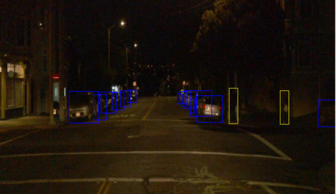
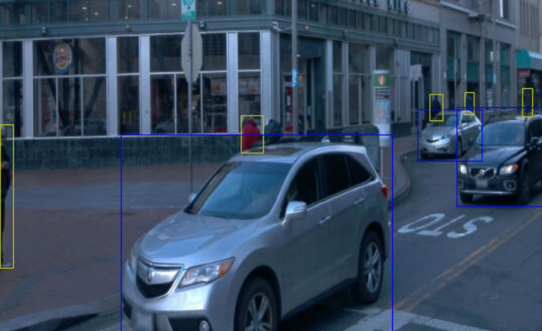
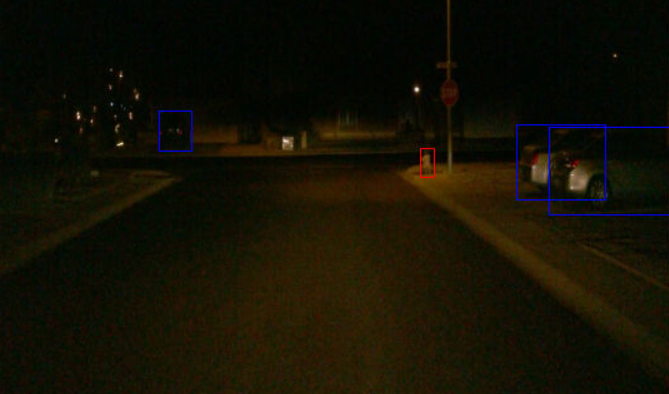
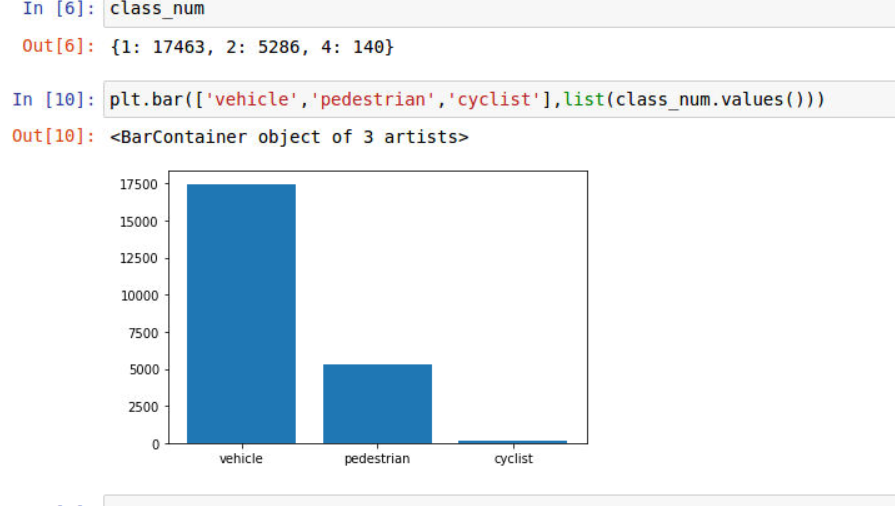
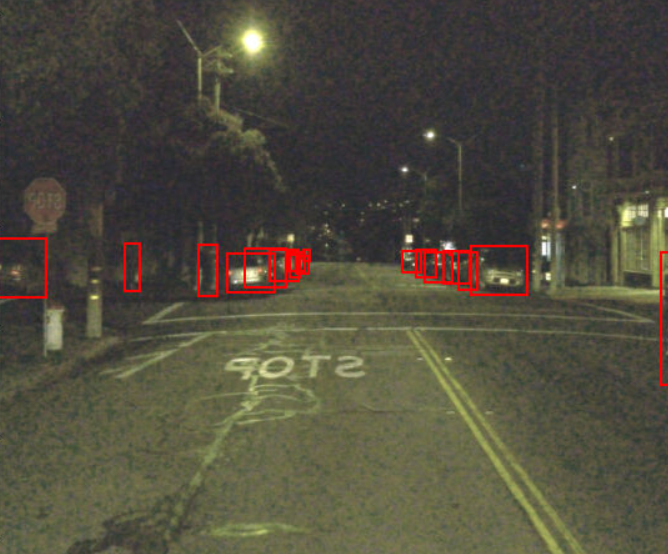
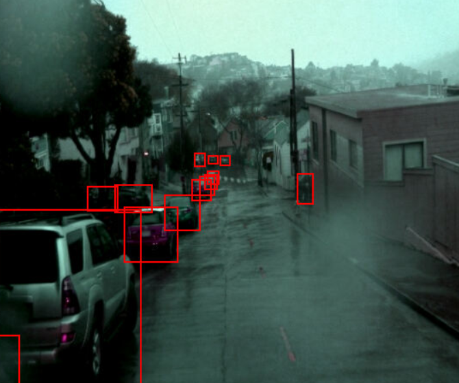
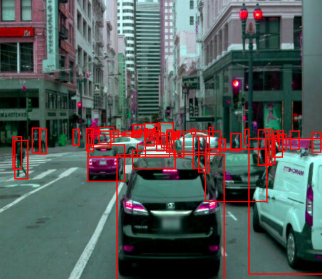
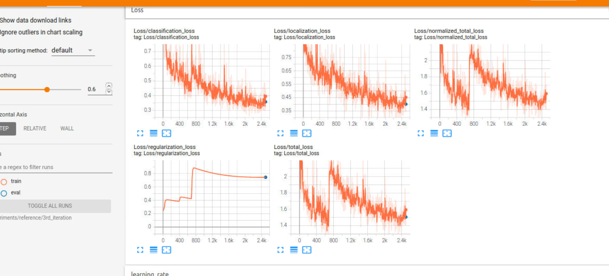
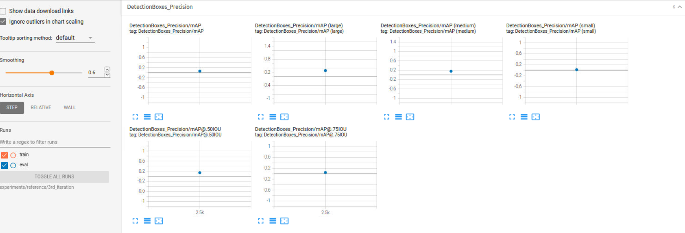
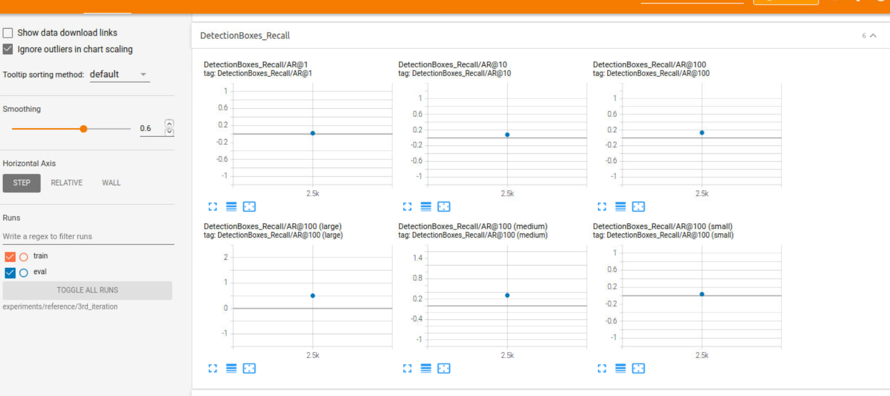

# Object-Detection-in-an-Urban-Environment

## Description


This Project is part of Data Science Nanodegree Program by Udacity. The goal of the project is to deploy a model with different hyperparameters and augmentations to train a neural network for detecting and classifying objects which is one of the crucial subject in autonomous driving. This deployment is done using tensorflow object detection API for detecting 3 classes of vehicles, pedestrians and cyclists.


### Data
 [Waymo Open dataset used in this project](https://waymo.com/open/). 
 
 
## Set up
The training, validation and testing should be in the data folder.
```
/home/workspace/data/
    - train: contained 86 tfrecords
    - val: contained 10 tfrecords
    - test - contained 3 files to test your model and create inference videos
```

The Experiments folder is were files used for training, evaluation, and saved models are stored. 
```
/home/workspace/experiments/
    - pretrained_model/
    - exporter_main_v2.py - to create an inference model
    - model_main_tf2.py - to launch training
    - reference/  - reference training with the unchanged config file
      - 1st_iteration/ - contains the pipeline config file with updated augmentation
      - 2nd_iteration/ - contains the pipeline config file with updated augmentation
      - 3rd_iteration/ - contains the pipeline config file with updated augmentation
    ...
```

### Editing the config files.
We need to download the pretrained model and move it to 

```
cd /home/workspace/experiments/pretrained_model/

wget http://download.tensorflow.org/models/object_detection/tf2/20200711/ssd_resnet50_v1_fpn_640x640_coco17_tpu-8.tar.gz

tar -xvzf ssd_resnet50_v1_fpn_640x640_coco17_tpu-8.tar.gz

rm -rf ssd_resnet50_v1_fpn_640x640_coco17_tpu-8.tar.gz
```

We need to edit the config files by running the following:

```
cd /home/workspace/
python edit_config.py --train_dir /home/workspace/data/train/ --eval_dir /home/workspace/data/val/ --batch_size 2 --checkpoint /home/workspace/experiments/pretrained_model/ssd_resnet50_v1_fpn_640x640_coco17_tpu-8/checkpoint/ckpt-0 --label_map /home/workspace/experiments/label_map.pbtxt
```
A new config file called ```pipeline_new.config``` will be created in the ```/home/workspace/ directory```. Move this file to the ```/home/workspace/experiments/reference/``` directory

## Dataset
#### Dataset analysis
This section should contain a quantitative and qualitative description of the dataset. 

##### Images from the dataset




##### Analysis



## Training

The hyperparameters for training the model are defined in the pipeline_new.config
### Training process
We run the script below to train. 
Note: The path and model directory has to modified for each training `


```
python experiments/model_main_tf2.py --model_dir=experiments/reference/1st_iteration --pipeline_config_path=experiments/reference/1st_iteration/pipeline_new.config
```
To monitor the training, you can launch a tensorboard instance by running ``` python -m tensorboard.main --logdir experiments/reference/ ```

### Evaluation process
We run the script below to evaluate the model. 
Note: The path and model directory has to modified for each evaluation

```
python experiments/model_main_tf2.py --model_dir=experiments/reference/1st_iteration/ --pipeline_config_path=experiments/reference/1st_iteration/pipeline_new.config --checkpoint_dir=experiments/reference/
```
### validation loss 
With the initial model from The residual network. The error and the loss is high thus the model does not perform so well.


### Precision and recall loss 
With the initial model from The residual network. The precision and recall are low  


## Improve on the reference
To improve the Model we apllied many iteration and in the last iteration we used augmentation: 

- rgb_to_gray by probability: 0.2

The augmentations can be found in the ``` /home/workspace/experiments/reference/3rd_iteration/pipeline_new.config ```

, also changed batch size to 5 ,updatd train_input_reader and eval_input_reader where this iteration gave the best prediction model

#### Images created after Augmentations





### validation loss 
After adding augmentations to the model, the error and the loss is reduces thus improved performance of the model.



### Precision and recall loss 
After adding augmentations to the model, the Precision and recall increases




## Creating an animation
### Export the trained model
Modify the arguments of the following function to adjust it to your models:

```
python experiments/exporter_main_v2.py --input_type image_tensor --pipeline_config_path experiments/reference/3rd_iteration/pipeline_new.config --trained_checkpoint_dir experiments/reference/3rd_iteration --output_directory experiments/reference/exported/ 
```

Create a video of your model's inferences for any tf record file. To do so, run the following command (modify it to your files):
```
python inference_video.py --labelmap_path label_map.pbtxt --model_path experiments/reference/exported/saved_model --tf_record_path data/test/segment-12012663867578114640_820_000_840_000_with_camera_labels.tfrecord --config_path experiments/reference/3rd_iteration/pipeline_new.config --output_path animation.gif
```

